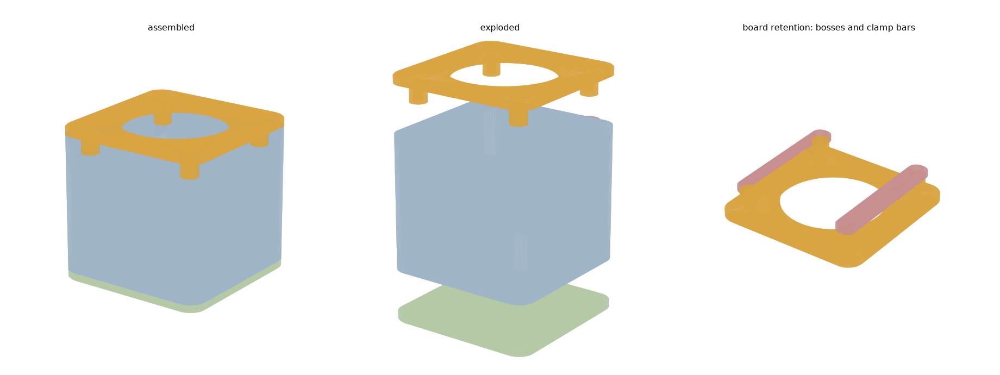

# Enclosure

A parametric 55 mm cube for the pomodoro cube, meant to be taken into Fusion 360
and fitted out there.

The model is [`cube.py`](cube.py). Running it writes STEP and STL for every
part into `build/`; the STEP files are committed, the STLs are not.

```sh
.venv/bin/python cube.py      # regenerate build/
.venv/bin/python preview.py   # regenerate preview.png
.venv/bin/python -m pytest    # 43 tests
```

First time:

```sh
python3 -m venv .venv && .venv/bin/pip install -r requirements.txt
```

## The parts



| part | qty | what it is |
|---|---|---|
| band | 1 | the four side faces as one square tube, 55 × 55 × 49 |
| top-plate | 1 | the display's face: conical seat, plus the four bosses that hold the board |
| back-plate | 1 | a plain plate with nothing in it |
| clamp-bar | 2 | screws down over two bosses and traps the board's rim |

Together they make an exact 55 × 55 × 55 mm cube. Each part is modelled in its
print orientation, lying on the bed at z=0, so nothing needs support and the
visible faces get the smooth side.

There is still no battery bay, no beeper hole, no face numerals and no joinery
between the band and the plates. Those are for Fusion.

## How the board is held

The Waveshare board **has no mounting holes** — its only through-holes are
0.50 and 0.76 mm vias. So it cannot be screwed down, and both the original and
this model clamp it instead. Two things do the work:

**The conical seat.** The display opening is not a bore. It narrows from
38.94 mm at the outer face to 35.70 mm at the inner one, a 28.4° taper measured
off the original. The module is 38.51 mm across, so it cannot pass through, and
it cannot sit proud either: it settles into the cone until the walls close to
its own diameter, which is 0.40 mm below the outer surface. That is what makes
the glass sit very slightly recessed in the finished face. The 35.70 mm throat
is sized just over the module's 35.67 mm bezel, so the opening shows the whole
bezel and none of the board behind it, while masking none of the 33.40 mm
picture.

**Four bosses and two bars.** The bosses stand 7.00 mm off the plate's inner
face on the diagonals, 20 mm out from the axis, each bored 3.20 mm for an M2
heat-set insert. They clear the 39.53 mm board by 5.52 mm. The two bars screw
down onto them with M2 screws and reach 3.27 mm over the board's rim on each
side, so the board is trapped between the bars and the seat.

One number here deserves a second look before you print: **`board_clamp_height`,
7.00 mm**, taken from the original because it is the only dimension verified
against a physical build of this exact board. The whole board stack is 8.40 mm
deep to the back of its rearmost components, but the bars bear on the bare rim,
not on those, so the two figures are not the same measurement and 7.00 mm cannot
be derived from 8.40 mm. Check it with a board in hand.

## Where the numbers came from

The original — [Timer cube by Robin](https://www.printables.com/model/1774785-timer-cube),
which the firmware here is forked from — is 55 × 55 × **62** mm, not a cube.
Its STLs were measured directly rather than eyeballed, and these carried over:

| | |
|---|---|
| Outer size | 55.00 mm (the original's footprint, now applied to all three axes) |
| Wall | 3.00 mm |
| Vertical corner radius | 6.00 mm outer, 3.00 mm inner |
| Bottom edge chamfer | 0.50 mm |
| Display seat | 38.94 → 35.70 mm, a 28.4° cone |
| Clamp height | 7.00 mm, on four M2 bosses |

These did not, being for internals this model leaves alone: a 38.5 × 10.4 × 28
battery bay, a Ø12.70 beeper hole, four more M2 inserts on a 47.24 mm square for
the lid, and numerals standing 0.30 mm proud for a single-layer colour change.

Board figures come from the STEP model Waveshare publish under Resources on the
[ESP32-S3-Touch-LCD-1.28 wiki page](https://www.waveshare.com/wiki/ESP32-S3-Touch-LCD-1.28),
which is the thing to measure against when the rest of the internals get
designed: PCB 39.53 mm across with a flat at the bottom for the USB-C, module
38.51 mm, bezel 35.67 mm, active area 33.40 mm, whole stack 8.40 mm deep.
